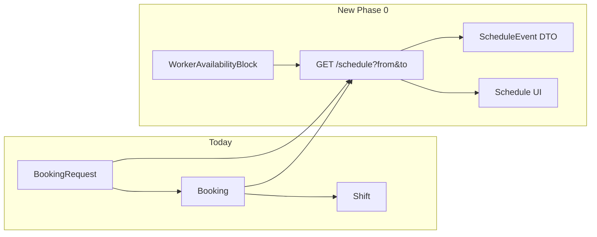
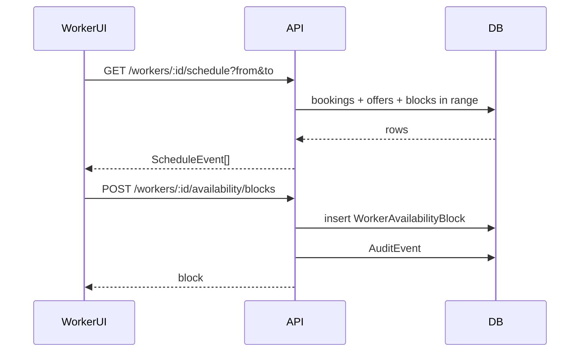

# Phase 0 Schedule System

## Goal

Complete the MVP with **slick, lightweight schedule surfaces** for workers and employers: see who is coming when, browse the week and a slightly longer horizon, and let workers mark basic availability/unavailability — all consistent with `@viora/ui` / `AppShell` patterns. **No OAuth or iCal sync in Phase 0**; document that as Phase 1 (already in [docs/ROADMAP.md](docs/ROADMAP.md) / PRD).

## Current state

- Time data already lives on `BookingRequest` / `Booking` (`startAt`, `endAt`); execution state on `Shift` ([schema.prisma](packages/database/prisma/schema.prisma)).
- APIs return **flat lists** only: `GET /v1/workers/:id/shifts` (25 items, no date filter) and `GET /v1/organisations/:id/bookings` (50 items).
- UIs show truncated lists inside **Shifts** / **Bookings** tabs — no calendar-oriented components in [packages/ui](packages/ui).
- Recurring availability exists only as typed **memory** (`WorkerAvailabilityMemoryValue` in [memory-values.ts](packages/domain/src/memory-values.ts)) — not queryable by date range and awkward for a tap-to-block UI.



## Scope

### In scope (Phase 0)

| Surface | What users see |
|---------|----------------|
| **Worker** (web + mobile) | New **Schedule** tab: week strip, day-grouped agenda, 4-week lookahead; confirmed shifts, pending offers, unavailable blocks; tap shift for detail/check-in link; tap offer → jump to Shifts deck |
| **Employer** (web) | **Schedule** view inside Bookings (List \| Schedule toggle): org coverage by day — confirmed worker per slot, open/unfilled requests highlighted; optional site filter chip row |
| **Availability** | Worker can add/edit/delete **specific unavailability blocks** (date + time range, optional note) and set a simple **weekly pattern** (e.g. Mon–Fri available, weekends off) |
| **API** | Date-range schedule endpoints returning a unified `ScheduleEvent` shape; availability CRUD with `AuditEvent` rows |
| **Docs** | Add to `PHASE_0_MUST_HAVE`, [TODO_PHASE0.md](docs/TODO_PHASE0.md), brief ROADMAP note that Google/Outlook sync follows in Phase 1 |

### Out of scope (Phase 1)

- OAuth, bidirectional Google Calendar / Outlook sync, iCal subscribe URLs
- Employer viewing worker private availability beyond what affects their bookings
- Admin calendar view (ops dash keeps existing unfilled list)
- Ranking/market-agent hard-blocking on availability blocks (optional soft follow-up; not required for schedule MVP)

---

## 1. Domain and Phase 0 registry

**New file:** [packages/domain/src/schedule.ts](packages/domain/src/schedule.ts)

```ts
export type ScheduleEventKind =
  | "confirmed_shift"      // Booking + Shift
  | "pending_offer"        // Worker only
  | "open_request"         // Employer only — unfilled BookingRequest
  | "unavailable_block";   // Worker only

export interface ScheduleEvent {
  id: string;
  kind: ScheduleEventKind;
  startAt: string;   // ISO
  endAt: string;
  timezone: string;  // org default or Europe/London
  title: string;     // role label
  subtitle?: string; // site or worker name
  status: string;
  meta: { bookingId?, shiftId?, offerId?, siteId?, siteName?, workerName?, payRate? };
}
```

**Helpers:** `groupEventsByDay(events, timezone)`, `formatScheduleRange(start, end, timezone)` using `en-GB` (match existing formatters in [workers.ts](apps/api/src/routes/workers.ts)).

**Update** [packages/domain/src/phase0.ts](packages/domain/src/phase0.ts):

```ts
"worker_schedule_view",
"employer_schedule_view",
"worker_availability_management",
```

Export from [packages/domain/src/index.ts](packages/domain/src/index.ts).

---

## 2. Data model — availability blocks

Add to [schema.prisma](packages/database/prisma/schema.prisma):

```prisma
enum AvailabilityBlockKind {
  unavailable
  preferred
}

enum AvailabilityPattern {
  none
  weekdays
  weekends
  custom   // uses daysOfWeek JSON
}

model WorkerAvailabilityBlock {
  id        String                @id @default(cuid())
  workerId  String
  worker    Worker                @relation(fields: [workerId], references: [id])
  kind      AvailabilityBlockKind @default(unavailable)
  startAt   DateTime
  endAt     DateTime
  note      String?
  createdAt DateTime              @default(now())
  updatedAt DateTime              @updatedAt

  @@index([workerId, startAt])
}
```

Extend `Worker` with optional `availabilityPattern AvailabilityPattern @default(weekdays)` and `availabilityDays Json?` for custom day set — keeps weekly pattern as one row, not many memory entries.

Migration + seed: add 1–2 demo blocks for `demo-worker` in [seed.ts](packages/database/prisma/seed.ts).

---

## 3. API

**New route module:** [apps/api/src/routes/schedule.ts](apps/api/src/routes/schedule.ts) (register in [apps/api/src/index.ts](apps/api/src/index.ts))

| Method | Path | Behaviour |
|--------|------|-----------|
| GET | `/v1/workers/:id/schedule?from=&to=` | Merge confirmed bookings (with shift/timesheet), pending offers in range, availability blocks; `orderBy startAt asc`; default window = start of current week → +28 days |
| GET | `/v1/organisations/:id/schedule?from=&to=&siteId=` | Merge open requests (`pending_confirmation`, `confirmed`, `broadcasting`, `filled` without worker) + confirmed bookings with worker name; site filter optional |
| GET | `/v1/workers/:id/availability` | Pattern + blocks in range |
| PUT | `/v1/workers/:id/availability/pattern` | Update `availabilityPattern` / `availabilityDays` |
| POST | `/v1/workers/:id/availability/blocks` | Create block (validate `endAt > startAt`, max 90-day span) |
| PATCH | `/v1/workers/:id/availability/blocks/:blockId` | Edit block |
| DELETE | `/v1/workers/:id/availability/blocks/:blockId` | Remove block |

**Implementation notes:**
- Reuse existing Prisma includes (site address formatting from [workers.ts](apps/api/src/routes/workers.ts) `formatSiteAddress`).
- Resolve `timezone` from `Organisation.timezone` (default `Europe/London`).
- All mutations call `writeAuditEvent` (`schedule.availability.*` actions).
- Keep existing `/shifts` and `/bookings` list endpoints for backward compatibility; schedule endpoints are the calendar source of truth.

**Smoke:** extend [scripts/smoke-phase0.mjs](scripts/smoke-phase0.mjs) to hit worker + org schedule with a 7-day window and assert non-empty demo data.

---

## 4. Shared UI (`@viora/ui`)

New components in [packages/ui/src/components/](packages/ui/src/components/) — CSS vars only, no heavy calendar library:

| Component | Role |
|-----------|------|
| `ScheduleWeekStrip` | Horizontal Mon–Sun pills; selected day accent; prev/next week chevrons |
| `ScheduleAgenda` | Events grouped under sticky day headers ("Today", "Tomorrow", weekday date) |
| `ScheduleEventRow` | Compact row: time range, title, subtitle, status pill (reuses visual language of `SettingRow`) |
| `ScheduleCoverageDay` | Employer variant: stacked chips per site/slot — filled (worker initials) vs open (dashed amber) |
| `ViewModeToggle` | Segmented **List \| Schedule** control (reuse `PreviewToggle` styling from [AppShell.tsx](packages/ui/src/components/AppShell.tsx)) |
| `AvailabilityBlockSheet` | Bottom sheet / inline form: date pickers, start/end time, note, Save — used on worker Schedule |

**Design principles:**
- Mobile-first: week strip + agenda (no dense month grid on phone).
- Desktop: same components, wider content column (520px employer / 460px worker — match existing pages).
- Status colors: `--accent` (offers), `--success` (confirmed), `--warning` (open/unfilled), `--muted` (past/completed).
- "Longer timeframe" = 4-week scrollable agenda with week strip jumping — not a full year calendar.

Export from [packages/ui/src/index.ts](packages/ui/src/index.ts).

---

## 5. App integration

### Worker web — [apps/worker-web/src/app/page.tsx](apps/worker-web/src/app/page.tsx)

- Nav: `Shifts | Schedule | Earnings | Passport | Profile` (insert at index 1).
- **Schedule tab:** fetch `/schedule` on week change; `ScheduleWeekStrip` + `ScheduleAgenda`; FAB or row action **Mark unavailable** → `AvailabilityBlockSheet`.
- Weekly pattern editor as `SectionCard` at bottom ("Usually available: Weekdays").
- Trim `ShiftHistory` on Shifts tab to **one** "Next up" row linking to Schedule (avoid duplication).
- Offer tap → `onNavChange("deck")`.

### Employer web — [apps/web/src/app/page.tsx](apps/web/src/app/page.tsx)

- Inside `BookingsTab`: `ViewModeToggle` at top.
- **List** = current `SectionCard` lists (unchanged).
- **Schedule** = site filter chips (from org sites) + `ScheduleWeekStrip` + `ScheduleCoverageDay` / agenda hybrid showing open vs filled slots.
- Tap event → lightweight detail row (worker name, role, timesheet status if completed).

### Mobile — [apps/mobile/app/index.tsx](apps/mobile/app/index.tsx)

- Add bottom tab bar (Schedule + Shifts minimum) aligned with worker-web labels.
- Schedule screen: same API + simplified React Native versions of week strip and agenda (inline styles matching dark theme, or extract token constants).
- Availability sheet as modal.

---

## 6. Phase 1 calendar sync (document only)

Add a short subsection to [docs/ROADMAP.md](docs/ROADMAP.md) under Phase 1 (alongside existing "calendar sync" bullet):

- **Subscribe export:** signed iCal feed per worker/org (`GET /v1/calendar/:token.ics`) generated from the same `ScheduleEvent` mapper.
- **OAuth:** Google Calendar + Microsoft Graph for two-way sync; consent + token storage; no duplicate bookings.
- Phase 0 schedule API and DTO become the single source for both in-app and external calendar rendering.

No implementation in this iteration.

---

## 7. Documentation and verification

- [docs/TODO_PHASE0.md](docs/TODO_PHASE0.md) — new **Schedule** section with checklist items.
- [DEVELOPMENT.md](DEVELOPMENT.md) — mention Schedule tab / endpoints if dev workflow changes.
- Run: `npm run db:migrate`, `npm run db:seed`, `npm run typecheck`, `npm run build`, `npm run test:phase0`.

---

## Architecture summary



## Risk / simplicity choices

- **No third-party calendar library** — custom week strip + agenda keeps bundle small and matches Viora's minimal aesthetic; revisit only if month-grid demand appears.
- **Availability as first-class rows**, not memory — avoids review-queue friction and enables clean date-range queries; recurring preferences stay on `Worker` columns, not `MemoryEntry`.
- **Employer schedule is read-only** — they see coverage; workers own availability editing.
