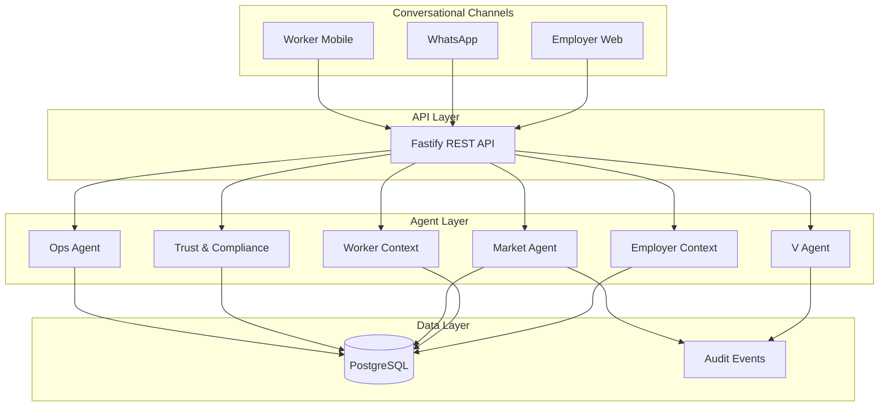

# Viora Architecture

Aligned with **[PRD v2.0 (June 2026)](./Viora_PRD_v2.md)** — Phase 0 pilot focus.

## System overview

## Domain model

Core entities (see `packages/database/prisma/schema.prisma`):

- **Organisation / Site** — employer hierarchy (MAT support via parent org)
- **Worker / Passport** — portable verified credentials
- **BookingRequest → Match → Offer → Booking → Shift**
- **Timesheet / Invoice** — payroll export in Phase 0
- **Conversation / AuditEvent** — omnichannel intake and immutable audit trail
- **GuardrailPolicy** — autonomy constraints (L0–L4)

## Phase 0 boundaries

**In scope:** text + WhatsApp intake, manual compliance verification, L1–L2 autonomy, check-in/out, timesheets, invoice export, employer web + worker mobile + admin console.

**Out of scope:** phone voice agent, full Passport v1, geofenced check-in, Dynamic Rate/L3+ negotiation rollout, Viora Pay, security vertical, Viora Connect API.

## Build order (recommended)

1. **Database + seed data** — organisations, sites, workers with compliance docs
2. **Booking engine** — request creation, eligibility filtering, ranking, offers
3. **V intake** — LLM-backed intent parsing (replace agent stubs)
4. **Worker swipe deck** — offer feed wired to Market Agent
5. **Shift lifecycle** — check-in/out, timesheets, self-healing basic flow
6. **Admin console** — compliance queue, ops dashboard, audit log viewer
7. **WhatsApp integration** — Business API webhooks

## Security baseline (non-deferred)

- Tenant isolation at data layer
- RBAC with least privilege
- MFA for compliance/finance roles
- Encryption at rest and in transit
- Immutable audit logs for all agent actions

## Success metrics (Phase 0)

| Metric | Target |
|--------|--------|
| Conversational intake rate | ≥ 70% |
| Intent capture accuracy | ≥ 95% |
| Median time-to-fill (same day) | ≤ 12 min |
| Fill rate (≤ 12h notice) | ≥ 90% |
| Compliance gate accuracy | 0 ineligible matches |
